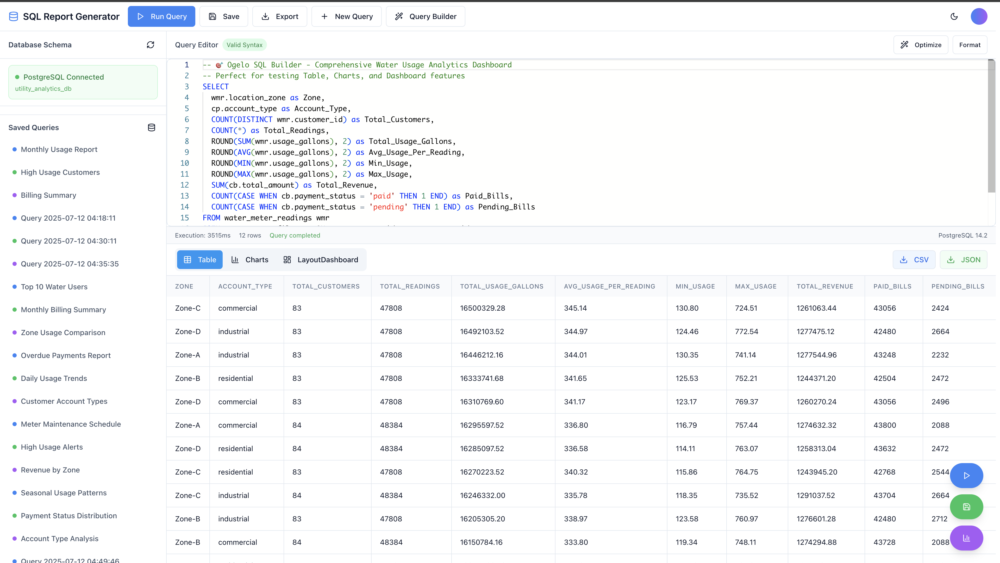

# Ogelo SQL Builder

A comprehensive SQL Builder built with React, TypeScript, and PostgreSQL, providing a professional visual GUI for SQL query building, execution, and reporting. Designed specifically for water utility data management with robust mock datasets and interactive data visualization.

https://sql-report-craft-augustineogelo.replit.app/




## 🌟 Features

### Core SQL Operations
- **Universal Query Builder**: Visual drag-and-drop interface supporting all SQL operations:
  - **SELECT**: Advanced queries with aggregations, joins, filters, and grouping
  - **INSERT**: Form-based data entry with column validation
  - **UPDATE**: Field selection with condition builder
  - **DELETE**: Safety warnings with required condition validation
  - **CREATE TABLE**: Column definition with data types and constraints

### Professional SQL Editor
- **Monaco Editor**: Full-featured code editor with SQL syntax highlighting
- **IntelliSense**: Auto-completion for tables, columns, and SQL keywords
- **Error Detection**: Real-time syntax validation and error highlighting
- **Query Formatting**: Automatic SQL code formatting and beautification

### Interactive Data Visualization
- **Multiple Chart Types**: Bar charts, line graphs, pie charts, scatter plots, histograms
- **Interactive Tables**: Sortable, filterable, paginated result tables
- **Dashboard Analytics**: Quick metrics and trend analysis
- **Export Capabilities**: CSV, JSON, and chart image exports

### Database Management
- **Schema Browser**: Interactive exploration of database structure
- **Live Connection**: Real-time PostgreSQL database connectivity
- **Query History**: Save and manage frequently used queries
- **Performance Metrics**: Query execution time and row count tracking

## 🏗️ Architecture

### Frontend Stack
- **React 18**: Modern component-based UI framework
- **TypeScript**: Full type safety throughout the application
- **Vite**: Lightning-fast development and build tooling
- **Tailwind CSS**: Utility-first styling with dark mode support
- **Radix UI**: Accessible component library with professional design
- **TanStack Query**: Advanced data fetching with caching and synchronization
- **Monaco Editor**: VS Code-quality SQL editing experience
- **Recharts**: Interactive and responsive data visualization

### Backend Stack
- **Node.js**: JavaScript runtime for server-side operations
- **Express.js**: Fast, minimalist web framework
- **TypeScript**: Type-safe server-side development
- **Drizzle ORM**: Modern, lightweight ORM with excellent TypeScript support
- **PostgreSQL**: Production-ready relational database
- **Zod**: Runtime type validation and schema enforcement

### Database Schema
The application includes comprehensive water utility datasets:

- **`customer_profiles`** (1,000 records): Customer information and account details
- **`water_meter_readings`** (24,000 records): Historical water consumption data with seasonal patterns
- **`customer_billing`** (24,000 records): Billing records with payment status tracking
- **`service_locations`** (1,000 records): Service location and meter information
- **`saved_queries`**: User-saved SQL queries with metadata

## 🚀 Quick Start

### Prerequisites
- Node.js 18+ installed
- PostgreSQL database (automatically configured)
- Modern web browser with JavaScript enabled

### Installation
1. Clone the repository
2. Install dependencies:
   ```bash
   npm install
   ```
3. Start the development server:
   ```bash
   npm run dev
   ```
4. Open http://localhost:5000 in your browser

### Database Setup
The application automatically initializes with comprehensive mock data:
- 1,000 unique customer profiles across residential, commercial, and industrial accounts
- 24,000 water meter readings with realistic seasonal consumption patterns
- Complete billing history with payment tracking
- Geographic data across multiple service zones

## 📊 Usage Guide

### Basic Query Execution
1. **Write SQL**: Use the Monaco editor with syntax highlighting
2. **Execute**: Click the "Run Query" button or press Ctrl+Enter
3. **View Results**: Results appear in an interactive table with sorting and filtering
4. **Visualize**: Automatic chart generation based on data types

### Visual Query Builder
1. **Open Builder**: Click "Query Builder" next to the editor
2. **Select Operation**: Choose from SELECT, INSERT, UPDATE, DELETE, or CREATE TABLE
3. **Configure Options**: Use the step-by-step interface for each operation type
4. **Generate SQL**: Review the generated SQL before execution

### Advanced Features
- **Save Queries**: Store frequently used queries with custom names and descriptions
- **Schema Exploration**: Browse database structure with column details and row counts
- **Export Data**: Download results in CSV or JSON format
- **Chart Customization**: Create custom visualizations with various chart types

## 🔧 Development

### Project Structure
```
├── client/src/
│   ├── components/          # Reusable UI components
│   │   ├── sql-editor/      # SQL editor and related components
│   │   └── ui/              # Base UI components (shadcn/ui)
│   ├── pages/               # Application pages
│   ├── hooks/               # Custom React hooks
│   └── lib/                 # Utility functions and configurations
├── server/                  # Express.js backend
│   ├── routes.ts            # API route definitions
│   ├── storage.ts           # Database operations
│   └── db.ts                # Database connection setup
├── shared/                  # Shared types and schemas
│   └── schema.ts            # Drizzle database schema
└── README.md
```

### Key Components

#### SQL Editor Components
- **`MonacoEditor`**: Main SQL editing interface with IntelliSense
- **`QueryBuilderModal`**: Visual query construction for all SQL operations
- **`ResultsTable`**: Interactive table for query results with export functionality
- **`SchemaBrowser`**: Database schema exploration with search and filtering
- **`FloatingActions`**: Quick access buttons for common operations

#### Backend API Endpoints
- **`POST /api/queries/execute`**: Execute SQL queries with validation
- **`GET /api/queries/saved`**: Retrieve saved queries
- **`POST /api/queries/save`**: Save new queries
- **`GET /api/schema`**: Get database schema information

### Database Operations
The application supports all major SQL operations through both the visual builder and direct SQL editor:

- **Data Analysis**: Complex SELECT queries with aggregations and joins
- **Data Entry**: INSERT operations with validation and error handling
- **Data Updates**: UPDATE operations with condition builders and safety checks
- **Data Deletion**: DELETE operations with required conditions to prevent data loss
- **Schema Changes**: CREATE TABLE operations with column definitions and constraints

## 🎯 Use Cases

### Water Utility Management
- **Usage Analytics**: Track water consumption patterns across different zones and account types
- **Billing Analysis**: Monitor payment statuses and revenue trends
- **Customer Insights**: Analyze customer demographics and usage behaviors
- **Operational Reporting**: Generate comprehensive reports for management and regulatory compliance

### SQL Learning and Development
- **Query Learning**: Ogelo's visual query builder helps users understand SQL syntax
- **Testing Environment**: Safe environment for experimenting with SQL queries
- **Best Practices**: Built-in validation and error prevention
- **Professional Tools**: Industry-standard editor with advanced features

## 🔐 Security Features

- **SQL Injection Prevention**: Parameterized queries and input validation
- **Error Handling**: Comprehensive error handling with user-friendly messages
- **Data Validation**: Zod schemas for runtime type checking
- **Safe Operations**: Confirmation dialogs for destructive operations

## 📈 Performance

- **Query Optimization**: Efficient database queries with proper indexing
- **Caching**: TanStack Query provides intelligent data caching
- **Lazy Loading**: Components load on demand for optimal performance
- **Real-time Updates**: Immediate feedback on query execution and results

## 🛠️ Technical Features

### Modern Development Stack
- **Type Safety**: End-to-end TypeScript coverage
- **Code Quality**: ESLint and Prettier for consistent code style
- **Hot Reloading**: Instant feedback during development
- **Build Optimization**: Vite provides optimized production builds

### User Experience
- **Responsive Design**: Works seamlessly on desktop and tablet devices
- **Dark Mode**: Full dark mode support with system preference detection
- **Accessibility**: WCAG compliant with keyboard navigation and screen reader support
- **Professional UI**: Clean, modern interface with smooth animations

## 📝 Contributing

1. Fork the repository
2. Create a feature branch
3. Make your changes with proper TypeScript types
4. Test your changes thoroughly
5. Submit a pull request with a clear description

## 📄 License

This project is licensed under the MIT License - see the LICENSE file for details.

## 🔗 Links

- **Live Demo**: Available on Replit
- **Documentation**: Comprehensive inline documentation
- **Support**: Submit issues through GitHub

---

**Ogelo SQL Builder**.
